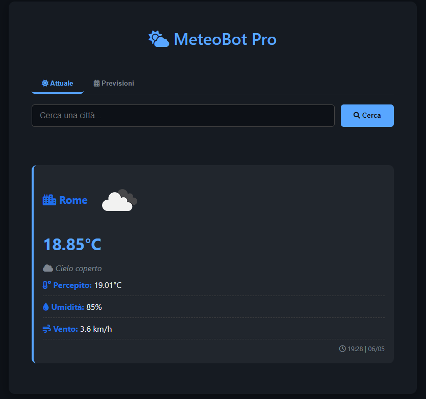
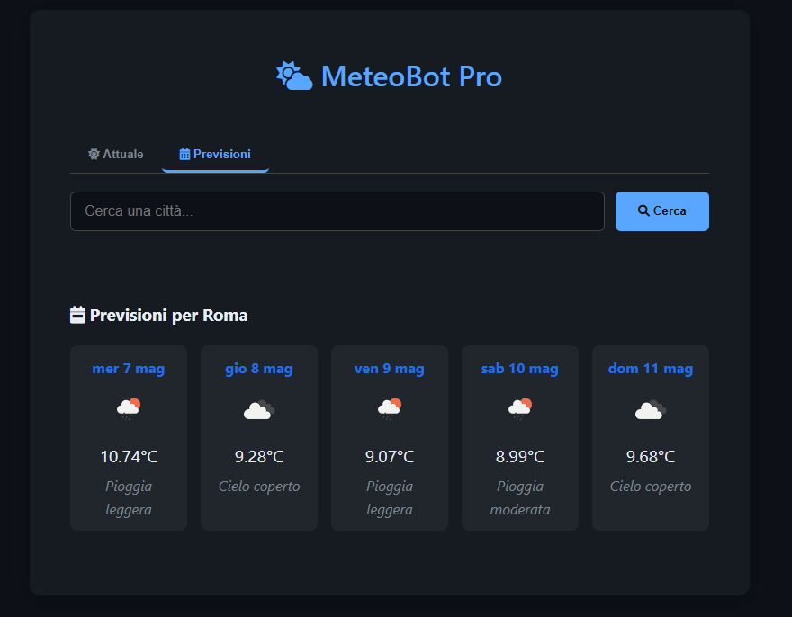

# 🌦️ MeteoBot - Weather Chatbot

Un'applicazione Flask che fornisce informazioni meteo attuali e previsioni con un'interfaccia dark mode.


## ✨ Funzionalità
- Ricerca meteo per città
- Visualizzazione dati attuali (temperatura, umidità, vento)
- Previsioni a 5 giorni
- Interfaccia dark mode
- Design responsive
- Animazioni fluide

## 🛠️ Tecnologie
- **Frontend**: HTML5, CSS3, JavaScript
- **Backend**: Python, Flask
- **API**: OpenWeatherMap
- **Icone**: Font Awesome





## 🚀 Installazione
1. Clona il repository:
```bash
git clone https://github.com/mttgvnrd/MeteoBot.git

